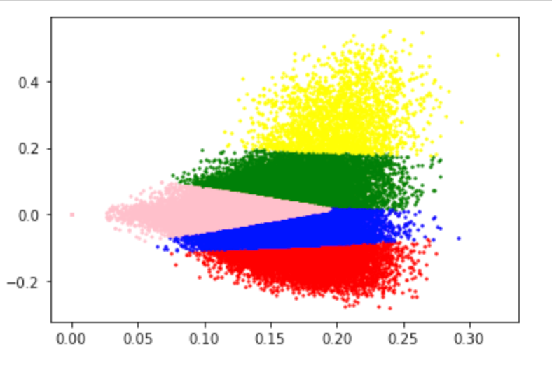

# MVP

## Data analysis and NLP

I have filtered rows from the original dataset and converted it into
a dataframe. Then I proceeded natural language processing and converted
words into a vector. The files for data analysis and NLP are [here](/data_processing).

The LSA model generated two groups of words. (Only containing top 20 words)

Topic 1: ```['2d', '3d', 'abil', 'abl', 'abov', 'acceler', 'access', 'account', 'accuracy', 'action', 'activ', 'ad', 'addition', 'adopt', 'advanc', 'advantag', 'adversari', 'affect', 'agent', 'agreement']```

Topic 2: ```['atom', 'band', 'black', 'charg', 'dark', 'decay', 'electr', 'electron', 'emiss', 'excit', 'gamma', 'gravit', 'hole', 'induc', 'lattic', 'magnet', 'materi', 'mathcal', 'matter', 'mode']```

## Baseline model

I did topic modeling using LSA and clustered them into 5 clusters using
K-means. The algorithm and virtualizations are shown [here](/model/baseline.ipynb).


